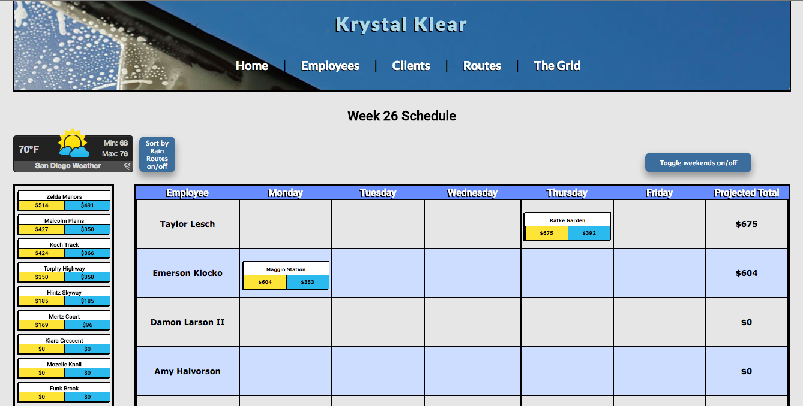

# Krystal Klear Window Cleaning Service

## Application Summary
Our group was tasked with adding a 'Grid' to an existing app to centralize the employee scheduling.  An admin can see a list of all jobs for the week and can assign each employee a routes for the week.  Each employee can sign in and see his/her work schedule.

This application is not meant to be public to customers, it's purpose is to make Krystal Klear Window Cleaning Services less paper dependent.

## Getting Started
- You must have postgres installed on your machine.
- This app uses Ruby version 2.1.5

Once you have these installed, run `bundle install` and you can access the application by running a local server using `rails s`.
You can login using 'admin@krystalklear.com', with '123456' as the password.

Screenshot of the 'Grid'
